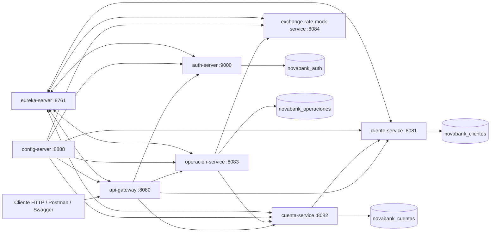
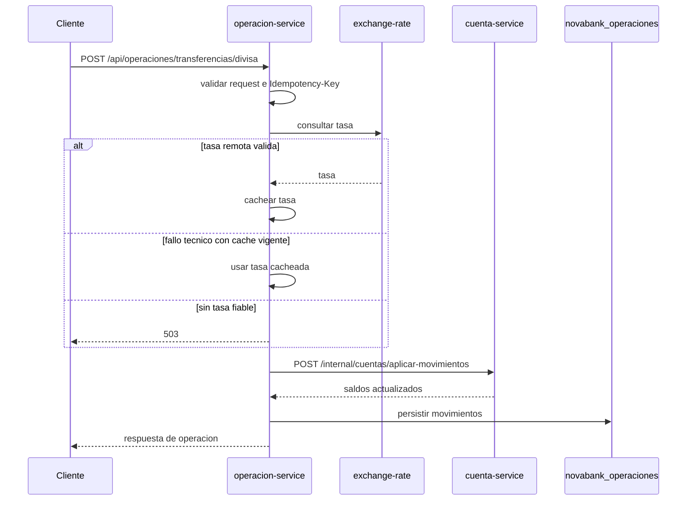

# NovaBank Digital Services - Modulo 5

NovaBank es un proyecto Maven multi-modulo que simula una plataforma bancaria con servicios independientes, comunicacion reactiva y persistencia separada por dominio. El estado actual corresponde al cierre tecnico del Modulo 5: servicios de negocio sobre Spring WebFlux, Spring Data R2DBC, Project Reactor, WebClient, trazabilidad, resiliencia reactiva, idempotencia y tests con PostgreSQL real mediante Testcontainers.

## Evolucion Del Proyecto

| Modulo | Estado |
| --- | --- |
| Modulo 1 | Base inicial del dominio bancario. |
| Modulo 2 | API REST y separacion por capas. |
| Modulo 3 | Aplicacion monolitica con seguridad y persistencia. |
| Modulo 4 | Transicion a microservicios sincronicos con Spring Cloud. |
| Modulo 5 | Migracion de Spring MVC a WebFlux, R2DBC, WebClient, SSE, idempotencia, resiliencia y observabilidad. |

## Capacidades Principales

- Registro, login y validacion de JWT.
- Gestion de clientes.
- Gestion de cuentas bancarias.
- Depositos, retiros y transferencias.
- Transferencias en divisa mediante proveedor mock de tipo de cambio.
- Historial de movimientos por cuenta.
- Streaming SSE de movimientos en tiempo real.
- Idempotencia publica con `Idempotency-Key` en operaciones financieras.
- Idempotencia interna en `cuenta-service` para movimientos atomicos.
- Caché de tipo de cambio con TTL de 5 minutos.
- Fallback seguro: sin tasa remota ni cacheada valida, la operacion se aborta.
- Trazabilidad con `X-Correlation-Id`, `traceId` y `spanId`.
- Resilience4j reactivo para llamadas remotas criticas.
- Tests reactivos con WebTestClient, StepVerifier, DataR2dbcTest y Testcontainers.

## Arquitectura General



Los servicios de negocio se comunican mediante WebClient con resolucion por Eureka. Cada servicio propietario de datos usa su propia base PostgreSQL.

## Topologia De Servicios

| Servicio | Puerto | Tipo | Responsabilidad | Base de datos |
| --- | ---: | --- | --- | --- |
| `eureka-server` | 8761 | Infraestructura | Registro y descubrimiento de servicios. | No aplica |
| `config-server` | 8888 | Infraestructura | Entrega configuracion desde un repositorio Git externo. | No aplica |
| `api-gateway` | 8080 | Edge reactivo | Entrada HTTP, validacion JWT perimetral y propagacion de trazas. | No aplica |
| `auth-server` | 9000 | Servicio reactivo | Registro, login y validacion de tokens. | `novabank_auth` |
| `cliente-service` | 8081 | Servicio reactivo | Alta, consulta y actualizacion de clientes. | `novabank_clientes` |
| `cuenta-service` | 8082 | Servicio reactivo | Cuentas, saldos, endpoint atomico, idempotencia interna y SSE. | `novabank_cuentas` |
| `operacion-service` | 8083 | Servicio reactivo | Depositos, retiros, transferencias, divisas e historial. | `novabank_operaciones` |
| `exchange-rate-mock-service` | 8084 | Mock reactivo | Tasas de cambio predefinidas para pruebas locales. | No aplica |
| `notificacion-service` | 8085 | Servicio reactivo | Consumidor Kafka para notificaciones de bienvenida. | No aplica |

## Estructura Del Repositorio

```text
NovaBank/
|-- pom.xml
|-- docker-compose.yml
|-- eureka-server/
|-- config-server/
|-- api-gateway/
|-- auth-server/
|-- cliente-service/
|-- cuenta-service/
|-- operacion-service/
|-- exchange-rate-mock-service/
|-- notificacion-service/
|-- docs/
|   |-- README.md
|   |-- sql/
|   |-- postman/
```

## Stack Tecnologico

| Area | Tecnologia |
| --- | --- |
| Lenguaje | Java 17 |
| Build | Maven multi-modulo |
| Plataforma | Spring Boot 3.3.6 |
| Cloud | Spring Cloud 2023.0.4 |
| Web | Spring WebFlux |
| Persistencia | Spring Data R2DBC |
| Base de datos | PostgreSQL |
| Comunicacion interna | WebClient con balanceo por Eureka |
| Gateway | Spring Cloud Gateway |
| Reactividad | Project Reactor, Mono y Flux |
| Streaming | Server-Sent Events |
| Backpressure | `onBackpressureDrop` en el stream de movimientos |
| Caché | Caffeine con TTL de 5 minutos |
| Resiliencia | Resilience4j reactivo |
| Trazabilidad | `X-Correlation-Id`, Micrometer Tracing con Brave, `traceId` y `spanId` |
| Testing | JUnit 5, Mockito, WebTestClient, StepVerifier, DataR2dbcTest, Testcontainers |
| Documentacion API | OpenAPI/Swagger por microservicio |

## Requisitos Previos

- Java 17.
- Maven 3.9 o compatible.
- PostgreSQL para ejecucion local.
- Git.
- Docker Desktop o runtime compatible para ejecutar Testcontainers.

## Infraestructura Local Con Docker Compose

El entorno local incluye Apache Kafka `apache/kafka:3.7.0` en modo KRaft, sin Zookeeper, y Kafka UI para inspeccion del cluster. Kafka no crea topics automaticamente.

Levantar la infraestructura desde la raiz del proyecto:

```powershell
docker compose up -d
```

Comprobar el estado de los contenedores:

```powershell
docker compose ps
```

Comprobar Kafka listando topics desde el contenedor:

```powershell
docker compose exec kafka /opt/kafka/bin/kafka-topics.sh --bootstrap-server kafka:9092 --list
```

Kafka UI queda disponible en:

```text
http://localhost:8090
```

La UI y otros contenedores se conectan al broker usando el listener interno de Docker Compose: `kafka:9092`. Los clientes locales desde el host deben usar `localhost:9092`, publicado contra el listener externo del contenedor.

Ver logs:

```powershell
docker compose logs -f kafka
docker compose logs -f kafka-ui
```

Apagar el entorno:

```powershell
docker compose down
```

## Base Tecnica De Eventos Del Modulo 6

Se incorporan las dependencias base de Spring Cloud Stream reactivo solo en los servicios que podran producir o consumir eventos:

- `cliente-service`
- `cuenta-service`
- `operacion-service`

Dependencias añadidas:

- `spring-cloud-stream`
- `spring-cloud-stream-binder-kafka-reactive`
- `novabank-events`, modulo comun interno con contratos de eventos.

No se declara `spring-kafka` de forma directa: llega transitivamente a traves de `spring-cloud-stream-binder-kafka-reactive` y se usa para `NewTopic` y `TopicBuilder`.

Los contratos iniciales estan en `novabank-events` bajo `com.novabank.events`:

- `ClienteRegistradoEvent`
- `OperacionSolicitadaEvent`
- `OperacionCompletadaEvent`
- `OperacionFallidaEvent`
- `MovimientoRegistradoEvent`
- `AlertaSaldoBajoEvent`

Todos los eventos incluyen `eventId`, `correlationId` y `occurredAt`, y transportan solo datos simples del dominio.

Topics previstos:

| Topic | Particiones | Retencion local |
| --- | ---: | --- |
| `novabank.clientes.registrados` | 3 | 7 dias |
| `novabank.operaciones.solicitadas` | 6 | 7 dias |
| `novabank.operaciones.completadas` | 6 | 7 dias |
| `novabank.operaciones.fallidas` | 6 | 30 dias |
| `novabank.movimientos.registrados` | 6 | 7 dias |
| `novabank.alertas.saldo-bajo` | 3 | 30 dias |

Los nombres de topics estan centralizados en `NovaBankTopics`.

La declaracion programatica de topics esta en `cliente-service`, clase `KafkaTopicsConfig`. Se ubica ahi de forma inicial porque `cliente-service` sera un productor de eventos del modulo y permite validar la creacion de topics sin introducir productores, consumidores ni cambios de flujo.

`cliente-service` publica `ClienteRegistradoEvent` despues de guardar correctamente un cliente. La publicacion usa Spring Cloud Stream con `StreamBridge`, binding `clienteRegistrado-out-0`, y destino `novabank.clientes.registrados`. Si el cliente no se guarda, no se publica evento. Si Kafka rechaza la publicacion, el alta devuelve un error controlado `EVENT_NOT_PUBLISHED` para priorizar la consistencia del caso practico.

Para validar la creacion de topics:

```powershell
docker compose up -d
mvn -pl cliente-service spring-boot:run
docker compose exec kafka /opt/kafka/bin/kafka-topics.sh --bootstrap-server kafka:9092 --list
```

Tambien se pueden comprobar en Kafka UI:

```text
http://localhost:8090
```

La configuracion base local usa `localhost:9092` para `spring.kafka.bootstrap-servers` y `spring.cloud.stream.kafka.binder.brokers`. Si un repositorio externo de Config Server define estos mismos valores para los servicios, debe incluir la misma configuracion para no sobrescribir el entorno local.

## notificacion-service

`notificacion-service` es el primer consumidor Kafka del Modulo 6. No expone controladores REST de negocio y no usa base de datos. Por ahora consume `ClienteRegistradoEvent` desde el topic `novabank.clientes.registrados` y registra en logs una notificacion de bienvenida con `clienteId`, `nombre` y `email`.

Configuracion local principal:

- Aplicacion: `notificacion-service`
- Puerto: `8085`
- Funcion Spring Cloud Stream: `notificarBienvenida`
- Binding de entrada: `notificarBienvenida-in-0`
- Topic: `novabank.clientes.registrados`
- Grupo consumidor: `notificacion-service`
- Broker local: `localhost:9092`
- Content type: `application/json`

Si Config Server carga configuracion desde un repositorio externo, ese repositorio debe incluir estas mismas propiedades para `notificacion-service`:

```yaml
server:
  port: 8085

spring:
  application:
    name: notificacion-service
  kafka:
    bootstrap-servers: localhost:9092
  cloud:
    function:
      definition: notificarBienvenida
    stream:
      bindings:
        notificarBienvenida-in-0:
          destination: novabank.clientes.registrados
          group: notificacion-service
          content-type: application/json
      kafka:
        binder:
          brokers: localhost:9092
```

Arrancar el consumidor:

```powershell
docker compose up -d
mvn -pl notificacion-service spring-boot:run
```

Publicar manualmente un `ClienteRegistradoEvent` desde consola:

```powershell
docker compose exec -i kafka /opt/kafka/bin/kafka-console-producer.sh --bootstrap-server kafka:9092 --topic novabank.clientes.registrados
```

JSON de ejemplo:

```json
{"eventId":"11111111-1111-1111-1111-111111111111","correlationId":"22222222-2222-2222-2222-222222222222","occurredAt":"2026-06-03T10:15:30Z","clienteId":1001,"dni":"12345678Z","nombre":"Ana Garcia","email":"ana.garcia@example.com"}
```

El log esperado en `notificacion-service` contiene:

```text
Notificacion de bienvenida preparada para clienteId=1001, nombre=Ana Garcia, email=ana.garcia@example.com
```

Tambien se puede publicar el mismo JSON desde Kafka UI en `http://localhost:8090`, topic `novabank.clientes.registrados`.

## Validacion Manual Del Evento Cliente Registrado

Precondicion: `cliente-service` necesita la configuracion R2DBC/PostgreSQL local del Modulo 5 o las propiedades equivalentes desde Config Server externo.

Arrancar Kafka y los servicios implicados:

```powershell
docker compose up -d
mvn -pl notificacion-service spring-boot:run
mvn -pl cliente-service spring-boot:run
```

Crear un cliente directamente contra `cliente-service`:

```powershell
Invoke-RestMethod -Method Post `
  -Uri http://localhost:8081/api/clientes `
  -ContentType "application/json" `
  -Headers @{ "X-Correlation-Id" = "33333333-3333-3333-3333-333333333333" } `
  -Body '{"nombre":"Ana","apellidos":"Garcia","dni":"12345678Z","email":"ana.garcia@example.com","telefono":"600111222"}'
```

Comprobar el evento en Kafka UI:

```text
http://localhost:8090
```

Topic esperado:

```text
novabank.clientes.registrados
```

Comprobar en logs de `notificacion-service`:

```text
Notificacion de bienvenida preparada para clienteId=<id>, nombre=Ana, email=ana.garcia@example.com
```

## Procesamiento Kafka De Operaciones En cuenta-service

`cuenta-service` incorpora el primer consumidor Kafka financiero del Modulo 6. Consume `OperacionSolicitadaEvent` desde `novabank.operaciones.solicitadas`, grupo `cuenta-service`, y aplica por ahora operaciones simples reutilizando la logica reactiva existente:

- `DEPOSITO`: usa `cuentaDestinoId` y publica `OperacionCompletadaEvent`.
- `RETIRO` o `RETIRADA`: usa `cuentaOrigenId`; si la cuenta no existe, no hay saldo suficiente o la solicitud es invalida, publica `OperacionFallidaEvent`.

No se cambian controladores, respuestas HTTP, SAGA, SSE ni Kafka Streams. El consumidor se declara como `procesarOperacion` y delega en `CuentaService`. Los eventos de resultado se publican con `StreamBridge` en estos bindings:

| Binding | Topic |
| --- | --- |
| `procesarOperacion-in-0` | `novabank.operaciones.solicitadas` |
| `operacionCompletada-out-0` | `novabank.operaciones.completadas` |
| `operacionFallida-out-0` | `novabank.operaciones.fallidas` |

La configuracion local de `cuenta-service` usa Kafka en `localhost:9092`. Si Config Server sobrescribe propiedades desde un repositorio externo, ese repositorio debe incluir valores equivalentes:

```yaml
spring:
  kafka:
    bootstrap-servers: localhost:9092
  cloud:
    function:
      definition: procesarOperacion
    stream:
      bindings:
        procesarOperacion-in-0:
          destination: novabank.operaciones.solicitadas
          group: cuenta-service
          content-type: application/json
        operacionCompletada-out-0:
          destination: novabank.operaciones.completadas
          content-type: application/json
        operacionFallida-out-0:
          destination: novabank.operaciones.fallidas
          content-type: application/json
      kafka:
        binder:
          brokers: localhost:9092
```

Arrancar infraestructura y `cuenta-service`:

```powershell
docker compose up -d
mvn -pl cuenta-service spring-boot:run
```

Publicar un deposito manualmente:

```powershell
docker compose exec -i kafka /opt/kafka/bin/kafka-console-producer.sh --bootstrap-server kafka:9092 --topic novabank.operaciones.solicitadas
```

JSON de deposito:

```json
{"eventId":"11111111-1111-1111-1111-111111111111","correlationId":"22222222-2222-2222-2222-222222222222","occurredAt":"2026-06-03T10:15:30Z","operationId":"33333333-3333-3333-3333-333333333333","tipoOperacion":"DEPOSITO","cuentaOrigenId":null,"cuentaDestinoId":1,"importe":25.00,"moneda":"EUR"}
```

Resultado esperado: mensaje en `novabank.operaciones.completadas` con el mismo `operationId`, `correlationId`, `tipoOperacion`, `importe` y `moneda`.

JSON de retirada fallida por saldo insuficiente:

```json
{"eventId":"44444444-4444-4444-4444-444444444444","correlationId":"55555555-5555-5555-5555-555555555555","occurredAt":"2026-06-03T10:16:30Z","operationId":"66666666-6666-6666-6666-666666666666","tipoOperacion":"RETIRADA","cuentaOrigenId":1,"cuentaDestinoId":null,"importe":9999.00,"moneda":"EUR"}
```

Resultado esperado: mensaje en `novabank.operaciones.fallidas` con `codigoError` como `SALDO_INSUFICIENTE` si la cuenta existe pero no tiene saldo suficiente. Si la cuenta no existe, el codigo esperado es `CUENTA_NO_ENCONTRADA`.

Comprobar topics desde Kafka:

```powershell
docker compose exec kafka /opt/kafka/bin/kafka-topics.sh --bootstrap-server kafka:9092 --list
```

Consumir resultados desde consola:

```powershell
docker compose exec kafka /opt/kafka/bin/kafka-console-consumer.sh --bootstrap-server kafka:9092 --topic novabank.operaciones.completadas --from-beginning --timeout-ms 10000
docker compose exec kafka /opt/kafka/bin/kafka-console-consumer.sh --bootstrap-server kafka:9092 --topic novabank.operaciones.fallidas --from-beginning --timeout-ms 10000
```

Tambien se pueden revisar los topics y mensajes desde Kafka UI:

```text
http://localhost:8090
```

## Publicacion Asincrona De Operaciones Desde operacion-service

`operacion-service` publica solicitudes de operaciones simples en Kafka. Los endpoints de deposito y retiro pasan a ser asincronos: validan la peticion HTTP, publican `OperacionSolicitadaEvent` en `novabank.operaciones.solicitadas` y responden `202 Accepted` con un identificador de operacion.

Flujo actual:

```text
POST /api/operaciones/deposito
POST /api/operaciones/retiro
    -> operacion-service publica OperacionSolicitadaEvent
    -> cuenta-service consume la solicitud
    -> cuenta-service publica OperacionCompletadaEvent u OperacionFallidaEvent
```

Binding de salida en `operacion-service`:

| Binding | Topic |
| --- | --- |
| `operacionSolicitada-out-0` | `novabank.operaciones.solicitadas` |

Respuesta HTTP esperada:

```http
HTTP/1.1 202 Accepted
```

Ejemplo de respuesta:

```json
{"operationId":"33333333-3333-3333-3333-333333333333","estado":"SOLICITADA","mensaje":"DEPOSITO solicitada para procesamiento asincrono","tipoOperacion":"DEPOSITO","cuentaId":1,"importe":25.00}
```

Request de deposito:

```powershell
Invoke-RestMethod -Method Post `
  -Uri http://localhost:8083/api/operaciones/deposito `
  -ContentType "application/json" `
  -Headers @{ "X-Correlation-Id" = "22222222-2222-2222-2222-222222222222" } `
  -Body '{"cuentaId":1,"cantidad":25.00}'
```

Evento esperado en `novabank.operaciones.solicitadas`:

```json
{"eventId":"<uuid>","correlationId":"22222222-2222-2222-2222-222222222222","occurredAt":"<instant>","operationId":"<uuid>","tipoOperacion":"DEPOSITO","cuentaOrigenId":null,"cuentaDestinoId":1,"importe":25.00,"moneda":"EUR"}
```

Request de retiro:

```powershell
Invoke-RestMethod -Method Post `
  -Uri http://localhost:8083/api/operaciones/retiro `
  -ContentType "application/json" `
  -Headers @{ "X-Correlation-Id" = "55555555-5555-5555-5555-555555555555" } `
  -Body '{"cuentaId":1,"cantidad":9999.00}'
```

Evento esperado en `novabank.operaciones.solicitadas`:

```json
{"eventId":"<uuid>","correlationId":"55555555-5555-5555-5555-555555555555","occurredAt":"<instant>","operationId":"<uuid>","tipoOperacion":"RETIRADA","cuentaOrigenId":1,"cuentaDestinoId":null,"importe":9999.00,"moneda":"EUR"}
```

Para comprobar el flujo completo:

```powershell
docker compose up -d
mvn -pl cuenta-service spring-boot:run
mvn -pl operacion-service spring-boot:run
```

Despues de hacer los POST, revisar en Kafka UI:

```text
http://localhost:8090
```

Topics esperados:

- `novabank.operaciones.solicitadas`: eventos publicados por `operacion-service`.
- `novabank.operaciones.completadas`: resultado de deposito correcto procesado por `cuenta-service`.
- `novabank.operaciones.fallidas`: resultado de retiro fallido, por ejemplo por saldo insuficiente.

Notas pendientes del Modulo 6:

- La SAGA orquestada y la consulta de estado de operacion se implementaran en el siguiente bloque.
- La idempotencia publica de las operaciones asincronas se consolidara cuando exista estado persistido de operacion/SAGA.
- Transferencias ordinarias y transferencias en divisa conservan por ahora el flujo sincronico existente.

## Bases De Datos Y SQL

El proyecto usa cuatro bases PostgreSQL, una por servicio propietario de datos:

- `novabank_auth`
- `novabank_clientes`
- `novabank_cuentas`
- `novabank_operaciones`

El script recomendado para preparar el entorno local completo es:

```powershell
psql -U postgres -f docs/sql/00-novabank-modulo5-completo.sql
```

Tambien existen scripts individuales por base en `docs/sql`. La guia de uso esta en [docs/sql/README.md](docs/sql/README.md).

## Config Server

`config-server` lee la configuracion desde un repositorio Git externo. La ruta se parametriza con `CONFIG_REPO_URI` y mantiene un fallback local:

```yaml
spring:
  cloud:
    config:
      server:
        git:
          uri: ${CONFIG_REPO_URI:file:///C:/Users/Usuario/Desktop/config-repo}
```

Estructura esperada del repositorio de configuracion:

```text
config-repo/
|-- api-gateway.yml
|-- auth-server.yml
|-- cliente-service.yml
|-- cuenta-service.yml
|-- operacion-service.yml
|-- exchange-rate-mock-service.yml
|-- application.yml
```

Los servicios importan Config Server de forma opcional para facilitar ejecuciones de test y desarrollo.

## Orden De Arranque Local

Desde la raiz del proyecto, arrancar en terminales separadas:

```powershell
mvn -pl eureka-server spring-boot:run
mvn -pl config-server spring-boot:run
mvn -pl auth-server spring-boot:run
mvn -pl cliente-service spring-boot:run
mvn -pl cuenta-service spring-boot:run
mvn -pl exchange-rate-mock-service spring-boot:run
mvn -pl operacion-service spring-boot:run
mvn -pl notificacion-service spring-boot:run
mvn -pl api-gateway spring-boot:run
```

Comprobaciones basicas:

- Eureka: `http://localhost:8761`
- Gateway: `http://localhost:8080/actuator/health`

## Seguridad

`auth-server` expone los endpoints de autenticacion:

| Metodo | Ruta | Uso |
| --- | --- | --- |
| POST | `/api/auth/register` | Registrar usuario. |
| POST | `/api/auth/login` | Obtener JWT. |
| GET | `/api/auth/validate` | Validar JWT desde el Gateway. |

Para acceder a rutas protegidas a traves del Gateway, enviar:

```http
Authorization: Bearer <token>
```

El Gateway valida el token contra `auth-server` antes de enrutar a los servicios de negocio.

## Endpoints Principales

### cliente-service

| Metodo | Ruta |
| --- | --- |
| GET | `/api/clientes` |
| POST | `/api/clientes` |
| GET | `/api/clientes/{id}` |
| GET | `/api/clientes/dni/{dni}` |
| PUT | `/api/clientes/{id}` |

### cuenta-service

| Metodo | Ruta |
| --- | --- |
| POST | `/api/cuentas` |
| GET | `/api/cuentas/{id}` |
| GET | `/api/cuentas/numero/{numeroCuenta}` |
| GET | `/api/cuentas/cliente/{clienteId}` |
| GET | `/api/cuentas/{id}/saldo` |
| GET | `/api/cuentas/{id}/movimientos/stream` |

Endpoints internos mantenidos para integracion entre servicios:

| Metodo | Ruta |
| --- | --- |
| POST | `/internal/cuentas/{id}/depositos` |
| POST | `/internal/cuentas/{id}/retiros` |
| POST | `/internal/cuentas/transferencias` |
| POST | `/internal/cuentas/aplicar-movimientos` |

### operacion-service

| Metodo | Ruta |
| --- | --- |
| POST | `/api/operaciones/deposito` |
| POST | `/api/operaciones/retiro` |
| POST | `/api/operaciones/transferencia` |
| POST | `/api/operaciones/transferencias/divisa` |
| GET | `/api/operaciones/cuentas/{cuentaId}/movimientos` |

Las operaciones `POST` aceptan opcionalmente el header:

```http
Idempotency-Key: <clave-unica-del-cliente>
```

### exchange-rate-mock-service

| Metodo | Ruta |
| --- | --- |
| GET | `/api/exchange-rate?from=USD&to=EUR` |

## Comunicacion Entre Servicios

- `cuenta-service` consulta `cliente-service` con WebClient para validar que el cliente existe antes de crear una cuenta.
- `operacion-service` llama a `cuenta-service` con WebClient para depositos, retiros y transferencias.
- `operacion-service` consulta `exchange-rate-mock-service` con WebClient para transferencias en divisa.
- Las llamadas remotas propagan `X-Correlation-Id` y trazas de Micrometer.

## Transferencia En Divisa



La transferencia no modifica saldos si no existe una tasa fiable.

## Atomicidad E Idempotencia

`cuenta-service` ofrece el endpoint interno:

```http
POST /internal/cuentas/aplicar-movimientos
```

Este endpoint actualiza origen y destino dentro de una transaccion local reactiva y usa la tabla `operaciones_idempotentes` con:

- `operation_id`
- `request_hash`
- `estado`

`operacion-service` protege la frontera publica con `Idempotency-Key` y la tabla `operaciones_publicas_idempotentes`.

Comportamiento:

- Sin `Idempotency-Key`: la operacion mantiene compatibilidad y se ejecuta como una peticion nueva.
- Misma clave y mismo cuerpo ya completado: se devuelve la respuesta persistida sin tocar saldos ni guardar movimientos nuevos.
- Misma clave y cuerpo distinto: se devuelve conflicto `409`.
- Operacion en curso con la misma clave: se devuelve conflicto controlado.

## Caché Y Fallback Seguro

`ExchangeRateService` usa Caffeine para guardar tasas validas durante 5 minutos.

- Una respuesta remota valida se usa y se cachea.
- Un fallo tecnico remoto puede usar una tasa cacheada vigente.
- Una tasa ausente, invalida o vencida produce error controlado.
- No se usan tasas inventadas ni valores por defecto.

Si una transferencia en divisa se completa con tasa cacheada, la respuesta lo indica en el mensaje.

## SSE Y Backpressure

`cuenta-service` expone:

```http
GET /api/cuentas/{id}/movimientos/stream
```

El stream usa un bus en memoria con `Sinks.Many`, filtra por `cuentaId` y aplica `onBackpressureDrop`. Esto prioriza la estabilidad del servicio: un consumidor lento puede perder eventos. Los eventos SSE no son durables y se pierden si el servicio se reinicia.

## Observabilidad

- `api-gateway` genera `X-Correlation-Id` si la peticion no lo trae.
- Los servicios devuelven `X-Correlation-Id` en la respuesta.
- Los errores controlados incluyen `correlationId`.
- WebClient propaga el mismo identificador a servicios downstream.
- Micrometer Tracing con Brave aporta `traceId` y `spanId` en logs.

`X-Correlation-Id` identifica la peticion desde el punto de vista funcional. `traceId` y `spanId` se usan para observabilidad distribuida.

## Resilience4j Reactivo

Las llamadas remotas criticas estan protegidas con operadores reactivos de Resilience4j:

- validacion de cliente desde `cuenta-service`;
- llamadas financieras de `operacion-service` hacia `cuenta-service`;
- consulta de tipo de cambio hacia `exchange-rate-mock-service`.

Los fallos remotos se traducen a errores controlados. No se simulan exitos ni se aplican reintentos peligrosos sobre operaciones financieras no protegidas por idempotencia.

## Persistencia Y Separacion De Datos

Cada servicio es propietario de sus tablas. No hay claves foraneas entre bases de datos de servicios.

| Base | Tablas |
| --- | --- |
| `novabank_auth` | `usuarios` |
| `novabank_clientes` | `clientes` |
| `novabank_cuentas` | `cuentas`, `account_number_sequence`, `operaciones_idempotentes` |
| `novabank_operaciones` | `movimientos`, `operaciones_publicas_idempotentes` |

## Testing

Comandos principales:

```powershell
mvn clean test
mvn -pl cliente-service test
mvn -pl cuenta-service test
mvn -pl operacion-service test
```

Los tests de persistencia relevantes usan PostgreSQL mediante Testcontainers. Es necesario tener Docker Desktop o un runtime compatible en ejecucion para el reactor completo.

Tipos de prueba presentes:

- tests web reactivos con WebTestClient;
- tests de flujos con StepVerifier;
- tests de repositorio con DataR2dbcTest;
- tests de clientes WebClient;
- tests de idempotencia, SSE, fallback seguro, resiliencia y trazabilidad.

## Manejo De Errores

Los servicios devuelven respuestas de error controladas con codigo, mensaje, timestamp y `correlationId` cuando aplica. Los conflictos de idempotencia se devuelven como `409`, los errores de validacion como `400`, los recursos inexistentes como `404` y las dependencias remotas no disponibles como `503`.

## Limitaciones Conocidas

- No hay transaccion distribuida entre microservicios; la atomicidad implementada es local a `cuenta-service`.
- El stream SSE es en memoria y no es durable.
- `exchange-rate-mock-service` es un proveedor simulado para el caso practico.
- Config Server depende de un repositorio de configuracion externo.
- La seguridad usa JWT propio para el proyecto formativo; no implementa un servidor de autorizacion empresarial completo.

## Mejoras Futuras

- Persistencia durable de eventos de movimientos.
- Integracion con un proveedor real de tipo de cambio.
- Observabilidad centralizada con backend de trazas y metricas.
- Politicas avanzadas de autorizacion por roles.
- Paginacion y filtros adicionales en consultas de historico.

## Repositorio Y Autor

Proyecto academico NovaBank Digital Services para la formacion Backend Java NTT. El PDF de entrega del Modulo 5 se prepara aparte a partir del estado final documentado en este repositorio.
